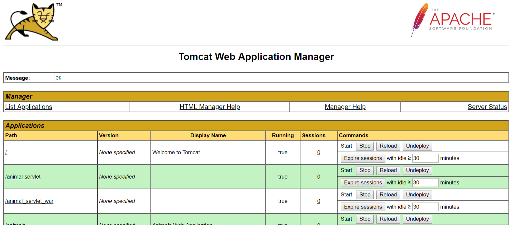

# JSP Servlets Examples

[Jest też dostępna polska wersja tutaj](README.pl.md)

[](https://www.codefactor.io/repository/github/towczare/jsp-sda)

## Enable tomcat manager

1. Edit following file:
```
TOMCAT\apache-tomcat-9.0.8\conf\tomcat-users.xml
```
2. Add following section:
```
<role rolename="manager-gui"/>
<user username="tomcat" password="tomcat" roles="tomcat,manager-gui,manager-script"/>
```
3. Start your tomcat by running `startup.sh` or `startup.bat`
4. Verify if manager is available `http://localhost:8080/manager/html`
5. Basic auth will require from you user and password, default for this configuration `tomcat/tomcat`
6. You should see following page:


## Maven configure settings
Paste content of following file `settings.xml` to `Users/USERNAME/.m2` directory (`~/.m2` linux users)
```
<?xml version="1.0" encoding="UTF-8"?>
<settings xmlns="http://maven.apache.org/SETTINGS/1.0.0"
          xmlns:xsi="http://www.w3.org/2001/XMLSchema-instance"
          xsi:schemaLocation="http://maven.apache.org/SETTINGS/1.0.0 http://maven.apache.org/xsd/settings-1.0.0.xsd">
 
 
<servers>  
    <server>
       <id>TOMCAT8</id>
       <username>tomcat</username>
       <password>tomcat</password>
    </server>
</servers> 
</settings>
```


## List of examples
0. [Simple hello-world-jsp-servlet](00_hello-world-jsp/README.md)
1. [Simple expressions-jsp-servlet](01_expressions-jsp/README.md)
2. [Simple declarations-jsp-servlet](02_declarations-jsp/README.md)
3. [Simple page-elements-jsp-servlet](03_page-elements-jsp/README.md)
4. [Simple bean-elements-jsp-servlet](04_bean-elements-jsp/README.md)
5. [Simple get-params-jsp-servlet](05_get-method-jsp/README.md)
6. [Simple post-params-jsp-servlet](06_post-method-jsp/README.md)
7. [Simple cookie-jsp-servlet](07_cookie-jsp/README.md)
8. [Simple session-jsp-servlet](08_session-jsp/README.md)
9. [Simple jstl-jsp-servlet](09_jstl-jsp/README.md)
